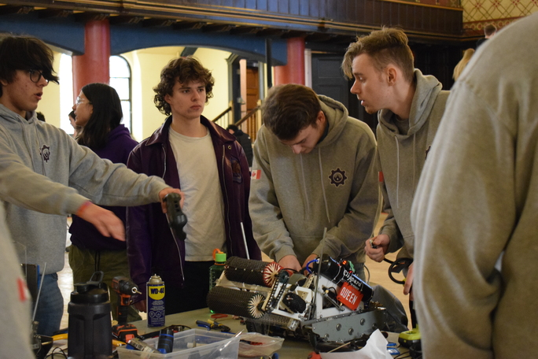

_Welcome_ to my website! Here I talk about my engineering projects and other topics like technology, carpentry and books. To reach me, don't hesitate to reach out at steedmanwill@gmail.com.

## Who am I?

I am a third year mechatronics engineering student at Queen's University. I chose mechatronics engineering because of the depth of opportunity for creativity and learning it has. Outside of my design projects I love weightlifting, the summer, carpentry, music (indie rock is my favorite) and reading. Right now I am reading [A Brief History of Intelligence](https://www.goodreads.com/book/show/62050269-a-brief-history-of-intelligence) by Max Bennett.

## Gallery

Here is my life in photos:

I have played hockey since I was four. I loved it so much back then that I used to wear a helmet in public, much to my parents' horror. Sorry Mom and Dad.

My friend Griff and I! Griff is my families' 7-year old Boston Terrier. He loves cheese.

Surfing (behind a boat)

I used to work as a carpenter's assistant for a summer. Mixing concrete gets messy...

## Why a Website?

I see this website as an opportunity for me to document my life as a student and person. I am hoping to look back when I am older and appreciate how much progress I have made! It also allows me to connect with other people with shared interests. Last, it feels nice to share projects and ideas that I am proud of!

