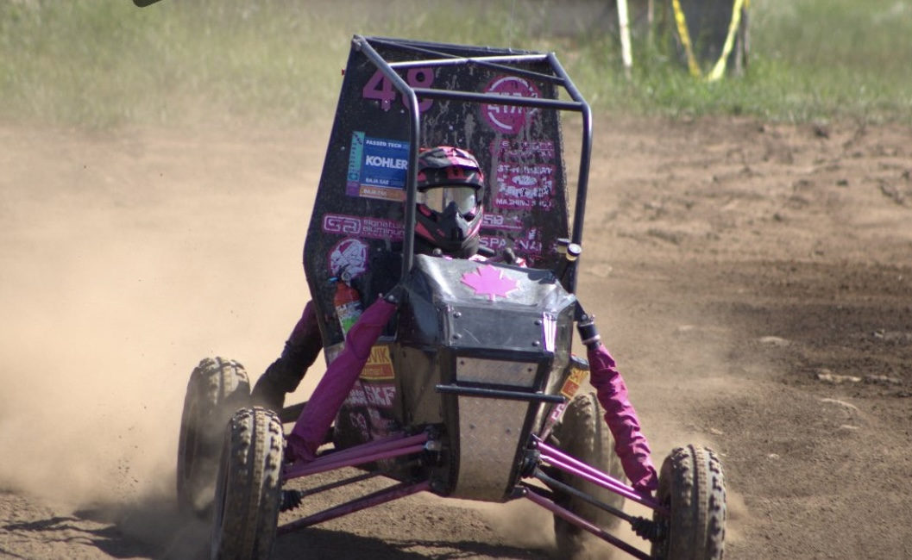
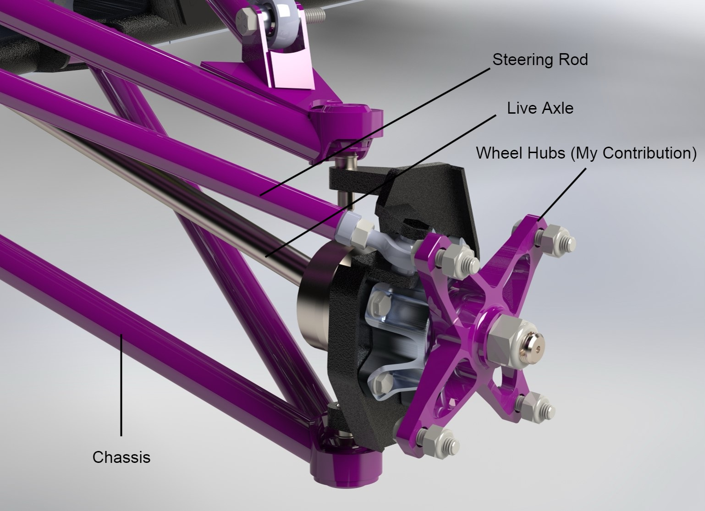
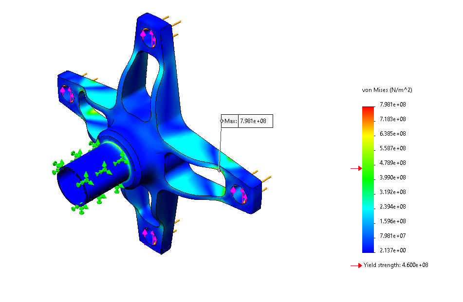
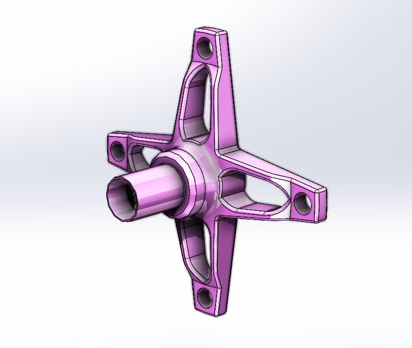
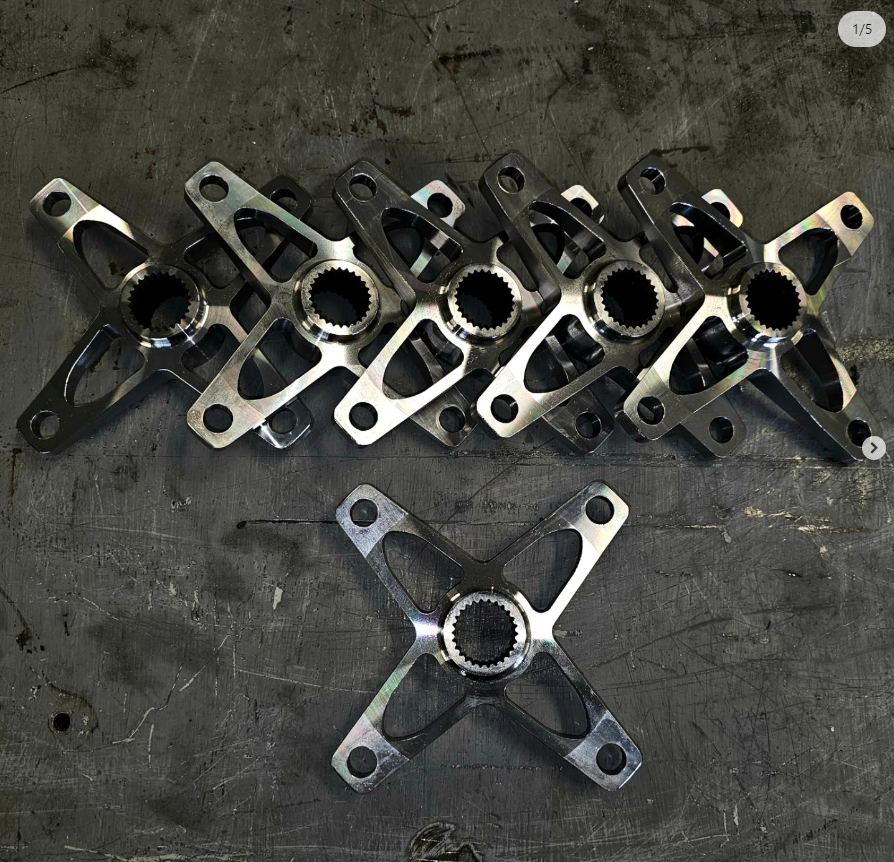

As part of the vehicle dynamics subteam for the Queen's University BAJA SAE Team, I optimized past hub designs using finite element analysis (FEA) to reduce weight by **7%** in spite of having **material 3.75x weaker** than previous years.

_Queen's '22-'23 BAJA Race Car at competition at OktoBajafest in Clarkson, NY_

## Experience, Learning & Skills

Experience:

- I was given the opportunity to **design, simulate and manufacture** the wheel hubs for the '22-'23 BAJA racer. I collaborated with 10 other engineering students apart of a vehicle dynamics subteam at the Queen's University BAJA Team.

Skills:

 - I developed skills in **Solidworks** and **SolidCAM** during the design and simulation phases of this project. Particularly, I learned how to setup/use **FEA** for design dynamics validation and ensure our parts could be manufactured using **CNC**
 
Lessons:

- **Manufacturing Matters!**     A dynamically and spatially feasible design doesn't equal a pragmatical design. Without considering manufacturing methods from project inception lots of time can be wasted designing un-makable parts. 

- **Learn from people.** I was fortunate to be mentored by Manny, a then third year Mech. Eng student. He taught me so much about FEA and how to optimize designs. I learned how important it is to ask questions and pay attention to experts around you.

## Motivation

Our team changed metal suppliers at the start of the year. This meant we didn't have access to the uber-strong Aermet Steel (1723N/mm^2) from before. We only had AISI 4130 (460N/mm^2), a much weaker steel. Race car competitions (think F1) are all about making your vehicle as manouverable, light and aerodynamic as possible. We wanted to take our old hubs (from below) and improve them to be lighter and stronger, allowing us to get faster times in competition.

_The '21-'22 wheel hubs, without the wheel attached_

## Technical Details

 Since we had a CAD from last year, the logical first step was to change the material from AerMet to 4130 and run an FEA on the design to see how it performed. For our loading values we used [this](https://www.irjet.net/archives/V9/i8/IRJET-V9I8313.pdf) paper. I set up an FEA and got these results.
 
 
 
 This result showed points on the hub where the material would permanently deform (yield) above an acceptable rate (Young's Modulus of AISI 4130, in this case 460 MPa). If we were to remanufacture the hubs w/ the same material we would surely break all of them.
 
 This meant we had to iterate! We wanted to keep the same general form (since we knew it was compatible with our current wheels and wheel package) so the iteration included modestly changing spoke geometry. 
 
 
I went through five iterations to reduce overall weight by 60g while keeping the hubs compatible with our wheel package. We used Solidworks CAM to make sure our hubs would be manufactureable on an outsourced 5-axis CNC mill. 

The final hubs looked like this. While you may not be able to even tell, the spoke shape and cutouts look different. 

Due to budget constraints we weren't able to manufacture the hubs during the '22-'23 season. However, during the '23-'24 season (barring some more optimizations that I was not apart of) my teammates were able to get these beautiful hubs made.

