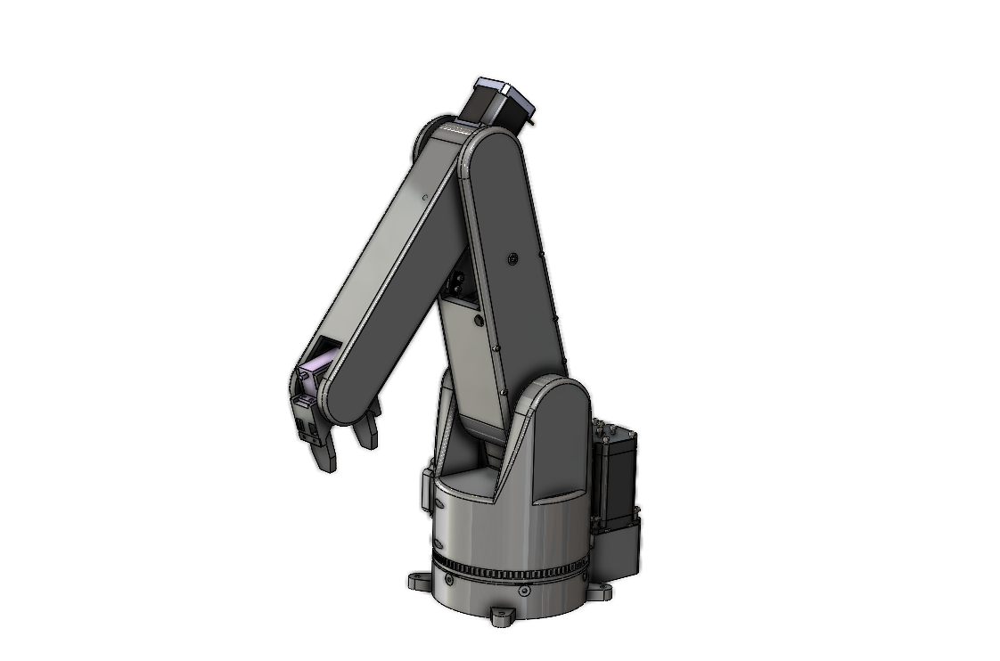

I always have a messy desk. To fix this, I designed, assembled and coded a **four degree-of-freedom**, **half-meter workspace**, **2kg payload, 3D-printed** robot arm that can pick up objects and wipe countertops.



## Experience, Learning & Skills

_Final CAD for Goose V1_

Experience & Skills:

- I followed [Shigley's Engineering Design Process](https://ia903102.us.archive.org/33/items/MechanicalEngineeringDesign9th/Mechanical%20Engineering%20Design%209th.pdf) through many iterations of **mechanical, electrical and software design**.

- I developed skills in **full-assembly mechanical design** in **Solidworks**, how to modularize and parameterize parts, electronic **circuit design and debugging**, interfacing electronic hardware with microcontrollers, and **elementary robotic control (FKin and IKin)**.

Learning:

- **Be dumb enough to start but smart enough to learn** - I didn't think too hard about starting a larger projects like this one or else I would have scared myself off from actually doing it. I found that it is best to embrace the unknown and adapt quickly to design problems as they present themselves. By being resourceful and iterating quickly on less-important design elements you can efficiently ascend towards working designs.

- **Design parts to fail (CAD+physically)** - I probably iterated on the wrist design for the project 20 times. Each time I began a new Solidworks part, imported my motors and other accessories, and re-designed from scratch. This was agonizingly inefficient. The trick I found is to _fix high-level geometry ASAP and paramaterize sketches around that geometry_. This way, you can work within one part and only change sketch dimensions as opposed to changing whole parts. The other part of this story is _modularizing parts to facilitate easy part exchanges_. When a super large, hard-to-reach part breaks it can set you back a long time to re-manucature and assemble. By designing discrete, exchangable and dynamically thoughtful parts you save a lot of time and headache.

## Motivation 

I think robot arms are beautiful in a lot of ways. They are a paradox; complicated in most engineering aspects, but perform tasks like picking up objects and applying forces that are ostensibly so simple. This project was motivated to explore and learn from the engineering complexities and attempt to execute some simple tasks like picking up objects. 

Above is a video of one fascination I had was the mechanical complexity of spherical wrists. Designiners have to find a way to trasmit rotation from revolute actuators typically located at the elbows to mutually perpendicular wrist joints. This often leads to super creative designs featuring belts, pulleys and universal joints.
