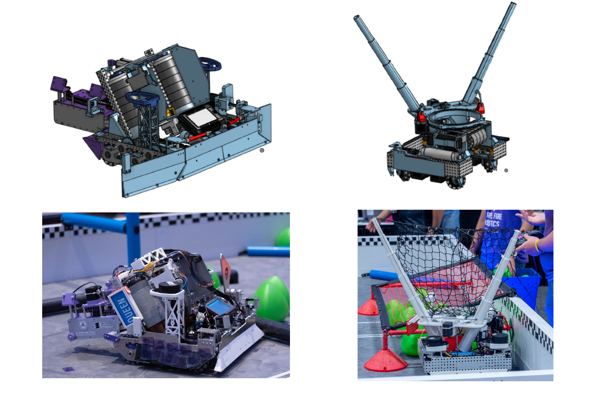
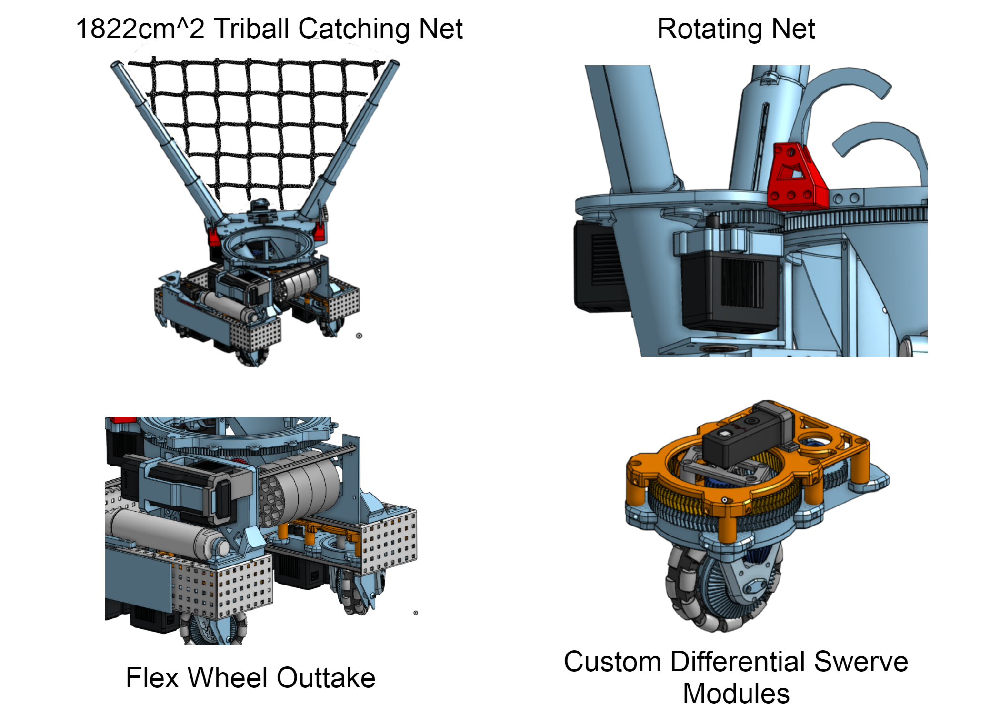
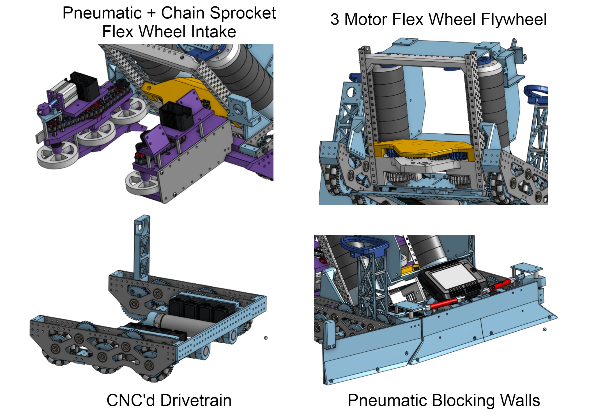
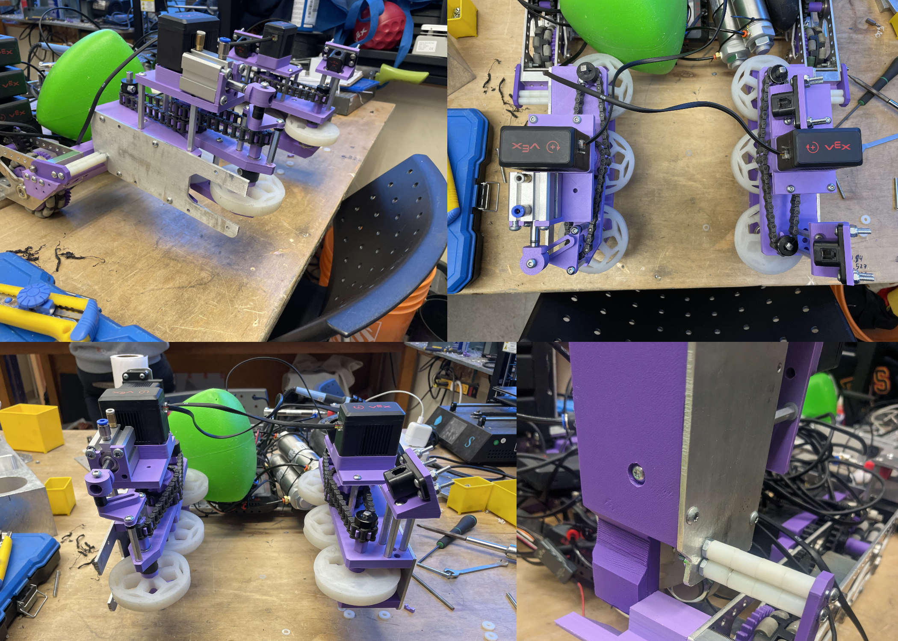

I joined QVEX during my second year at Queen's. At QVEX, we build competetive wheeled robots that can launch and catch projectiles, climb poles, and complete other game-related tasks, sometimes autonomously. As part of a mechanical design team, I assisted in development of **reliable projectile intake and launching mechanisms** that helped us to qualify and compete at the VEX U World Championships in Dallas. 



_Our match against Florida Southern College during Worlds_
## Experience, Learning & Skills

_24" Worlds Robot (left), 15" Worlds Robot (right)_

### Experience & Skills

- Collaborated with >10 engineering students using Onshape, Solidworks and Solidworks Simulation to design, prototype, manufacture and assemble four wheeled robots in 8 months

- Experimented with new mechanisms including rack & pinions, slip gears, chain and sprocket drives

- Developed skills for defending ideas, convincing colleagues of optimal strategies and communicating effectively

### Learning

- **Integration is hard**: CADding an entire system on your own is easy because you have an idea in your head of where each subsystem fits. CADding a system as a team is harder because every designer has their own ideas in their head of where each subsystem fits. Staying organized and making sure everyone is one the same page is a must-have for coherent final designs.

- **A design is not done until it is tested**: We ran out of time to thoroughly test our mechanisms for our Worlds Robots. As a consequence, we got destroyed in compettion at Worlds. We all consumed a little bit too much of what I like to call hopium. It probably isn't in any dictionary, but maybe it should be. Hopium: Irrational optimism and denial of Murphy's Law: "Anything that can go wrong will go wrong".

- **Beware the sunk-cost bias**: Robots are challenging to design and take some time to get right. This past year, we made mistakes by building the mechanisms that were strategically inferior for the game. However, because we spent so long developing these mechanisms, we fell in favor of them. Assessing your decisions at every stage of the design process can allow you to catch biases and make sure your decisions are grounded in what is best for the team

## Motivation

Why join QVEX? I joined for the experience and the people. I have learned a lot about team management, collaborative design, the mechanical design process and novel mechanisms. The opportunity has given me the chance to meet a lot of great and talented people interested in designing cool things. I would reccomend the experience for anyone interested in making things happen in robotics.

## Technical Details

VEX makes a new game every year. The '23-'24 game was called Over Under. You get points for putting game objects (a green releaux tetrahedron) under a net. Our robots' strategies were to lob balls from one robot to the other and fire them under the net. Basically, alley-oop robots. 


_Here is what I mean_

We had a 15" robot and a 24" robot. Note that a lot of the things that I am showing off were not designed by me. Everyone involved (not just mechanical) deserve a lot of credit: **Patrick, Michael, James, Theo, Cole, Maxim, Avery, Peter, Ryan, Nikola, Koen, Cass, Laura, Taylor, Xan, Becca, Ben, Liam, Cal, Callum, Evan, Kieran, Mike, Nick and everyone else I missed**.

 Our 15" robot was super innovative this year. Our key features were a 3D-printed differential swerve drive and a rotating, cascading net.

Our 24" robot was a lot bigger and more of a classic VEX style. Tank drive and almost 40lbs. Hard to move and designed to play defense and push around other robots.

### Intakes
#### What and How

In Over Under, our team's strategy was to launch triballs (the green releaux tetrahedrons from previous videos) from a loading zone over the field and into the other robot. We needed a system to reliably intake triballs from the loading zone into the robot so they could be launched by our flywheel system across the field. To do this, I designed a 6-wheel flex-wheel intake using chain and sprockets to suck game objects into our robot.

_The final design_

If interested, the video below highlights some of the features of the intakes and why they exist 



#### Issues, Solutions and Optimizations

We ran into a some technical issues before achieving a >95% success rate system. Here are the main ones:

- **Friction:** VEX Motors aren't very powerful and overheat when put under stress. We wanted our intakes to be fast and therefore needed a low gearbox reduction to achieve high speeds. Low gearbox reduction decreased available torque, making us particularly susceptible to motor stalling when exposed to oppositional forces. Using properly tensioned bearings and reducing shaft normal forces allowed us to reduce system friction.


_System Testing_

- **Tuning (Materials and Geometry):**

### Linear Puncher V4
#### What and How

#### Issues and Solutions
