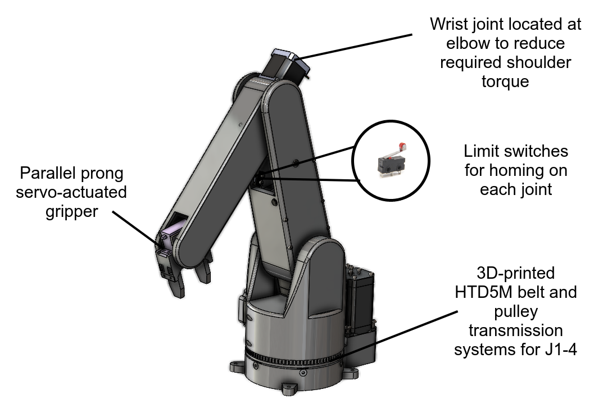
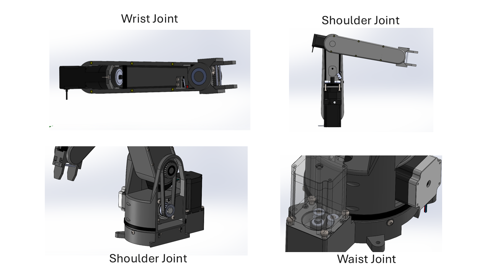
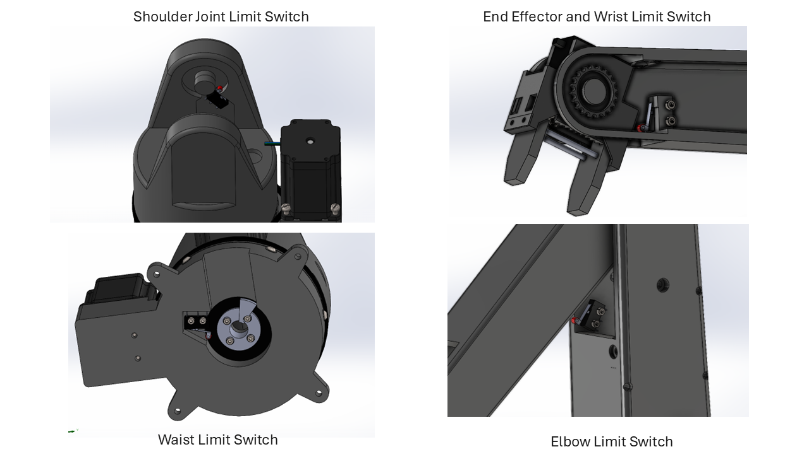
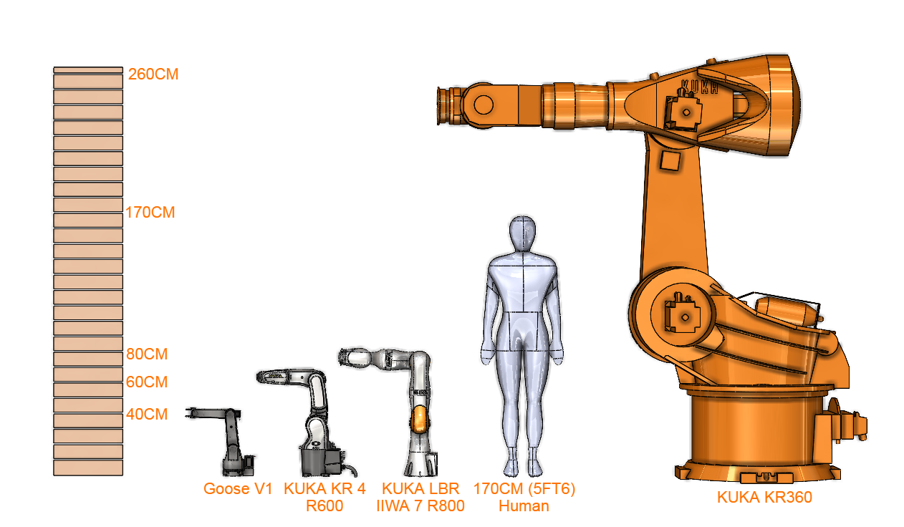
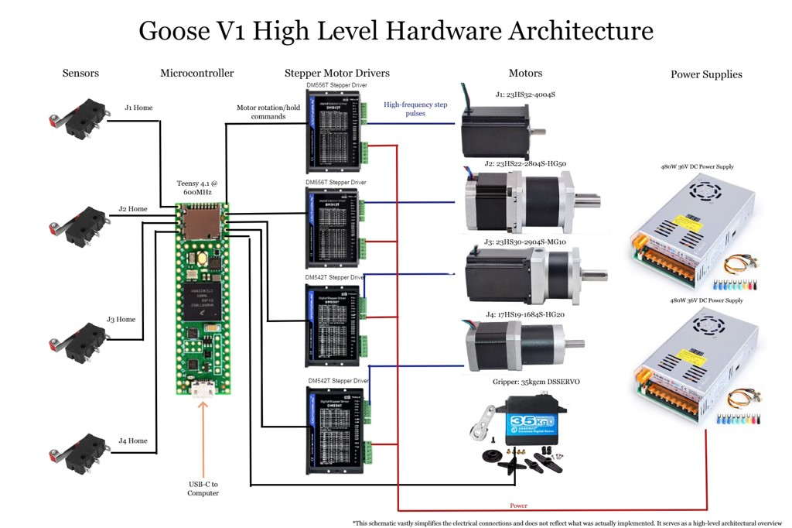
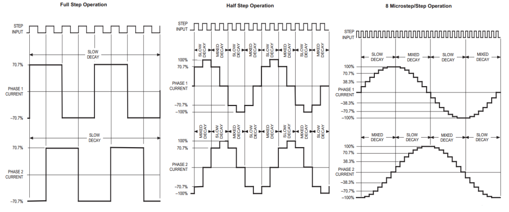
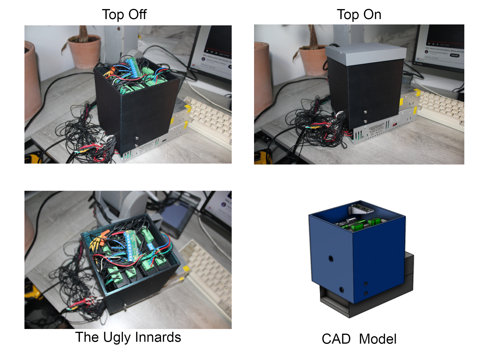
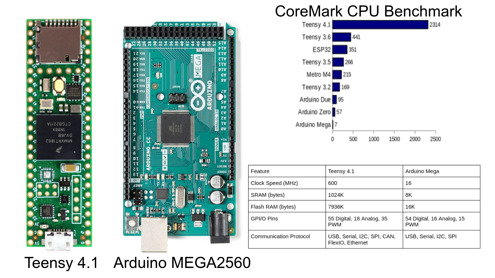
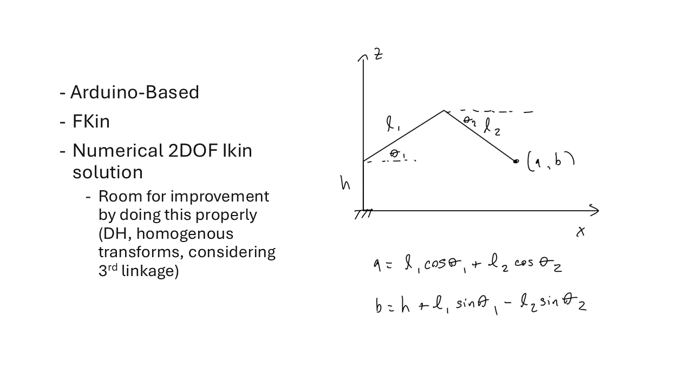
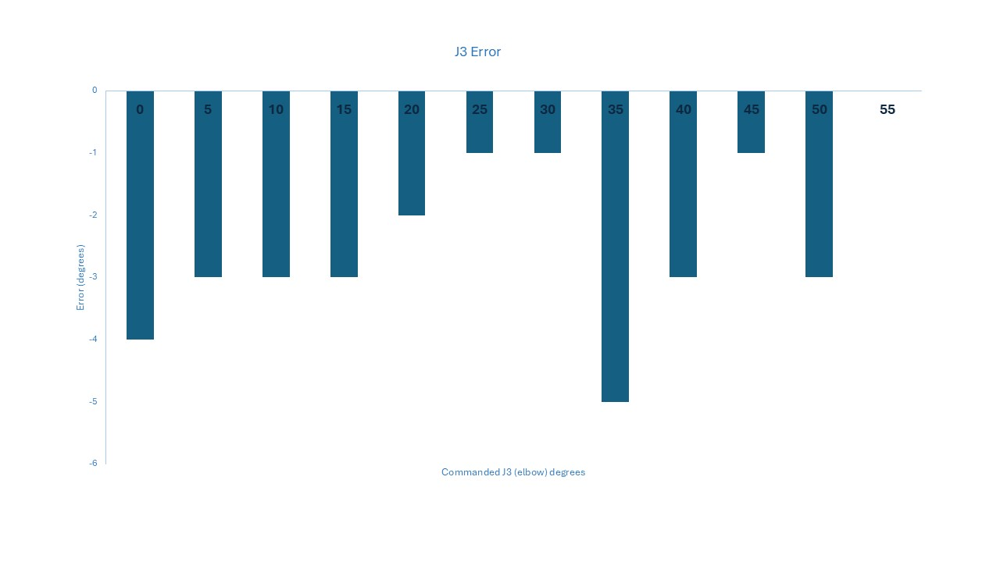

I always have a messy desk. To fix this, I designed, assembled and coded an open-source, **four degree-of-freedom**, **half-meter workspace**, **2kg payload, 3D-printed** robot arm that can pick up objects and wipe countertops.



## Experience, Learning & Skills

_Final CAD for Goose V1_

### Experience & Skills

- I followed [Shigley's Engineering Design Process](https://ia903102.us.archive.org/33/items/MechanicalEngineeringDesign9th/Mechanical%20Engineering%20Design%209th.pdf) through many iterations of **mechanical, electrical and software design**.

- I developed skills in **full-assembly mechanical design** in **Solidworks**, how to modularize and parameterize parts, electronic **circuit design and debugging**, interfacing electronic hardware with microcontrollers, and **elementary robotic control (FKin and IKin)**.

### Learning

- **Be dumb enough to start but smart enough to learn** - I didn't think too hard about starting a larger project like this one or else I would have scared myself off from actually doing it. I found that it is best to embrace the unknown and adapt quickly to design problems as they present themselves. 

- **Design parts to fail (CAD+physically)** - I probably iterated on the wrist design for the project 20 times. Each time I began a new Solidworks part, imported my motors and other accessories, and re-designed from scratch. This was agonizingly inefficient. The trick I found is to _fix high-level geometry ASAP and paramaterize sketches around that geometry_. This way, you can work within one part and only change sketch dimensions as opposed to changing whole parts. The other part of this story is _modularizing parts to facilitate easy part exchanges_. When a super large, hard-to-reach part breaks it can set you back a long time to re-manufacture and assemble. By designing discrete, exchangable and spatio-dynamically thoughtful parts you save a lot of time and headache.

## Motivation 

I think robot arms are beautiful paradoxes; complicated in most engineering aspects, but perform tasks like picking up objects that are ostensibly so simple. This project was motivated to explore and learn from these engineering complexities and attempt to execute some simple tasks like picking up objects and following trajectories.



_Above is a video of one fascination I had was the mechanical complexity of spherical wrists. Designiners have to be creative to find a way to trasmit rotation from revolute actuators typically located at the elbows to mutually perpendicular wrist joints._

## Technical Details

### Mechanical

Mechanical design took about 6 months to dial in. I iterated around 15 times towards more optimal (but certainly not perfect) design features. I determined that belts were advantageous to introduce because they allowed me to position heavy motors near the end of joints to offset the weight of other linkages.

Since I didn't have any closed-loop control on my motors (I chose open-loop because it was cheaper) I had to introduce some other strategy to guarantee that my linkages were in the right spot relative to their end-stops. I used limit switches (buttons) to achieve this.

I decided on using a linear rail rack-and-pinion gripper system. I took inspiration from [Chris Annin's design](https://www.anninrobotics.com/post/new-servo-gripper-for-the-ar4). It works well and it has some tactility because the servo can detect when it is beginning to stall. The solution isn't super repsonsive, though, and could be improved by adding a legit force sensor on the prong.



For scale, here is Goose V1 compared to some more legitimate robots from KUKA's fleet, with a human for scale.

### Electrical

The electronics architecture was governed by the sensor and actuator selection from the mechanical design. I needed two 36V, 480W power supplies connected in parallel to actuate the four NEMA stepper motors (3x NEMA 23, 1x NEMA 17) and their drivers. This power supply setup has enough power to independently power some microwaves or small ovens. 

Stepper motor drivers are signal translators. They take in high-level pulse input signals from a microcontroller (in my case, a Teensy 4.1) and translate these signals into stepped-up, high-fidelity square-wave pulses that the motor can use to move. They also act like a safe-guard and prevent any voltage spikes from damaging the motors. Evidently, they are pretty important for motor performance. 

_As the microcontroller inputs square wave pulses (top), the stepper driver outputs stepped up sinusoids. You can adjust the resolution of the output to be smoother if your application needs. As your resolution (the amount of microsteps/step) increases, the output pulses resemble smooth sinusoids more and more. The trade off of having high resolution is that you experience reduced torque._

After blowing up several [A4988 drivers](https://www.pololu.com/product/1182) (which I had a lot of trouble working with reliably), I bought the bullet and got some more expensive StepperOnline [DM556T](https://www.omc-stepperonline.com/en-ca/digital-stepper-driver-1-8-5-6a-20-50vdc-for-nema-23-24-34-stepper-motor-dm556t) and [DM542T](https://www.omc-stepperonline.com/en-ca/digital-stepper-driver-1-0-4-2a-20-50vdc-for-nema-17-23-24-stepper-motor-dm542t) drivers that accomodated my voltage and current specs. I enclosed all the electronics in a case for compactness. I learned that my cable management skills need work!

The last notable electronics optimization was the microcontroller itself. I originally was using an old Arduino ATMega board but discovered that the Teensy 4.1 had way more appealing features. Mostly, its 600MHz clock speed and 1024K SRAM appealed to me because it would make algorithm computation super fast, leading to smoother arm kinematics.

_The Teensy 4.1 performs 330.57 times better than a standard Arduino Mega when tested on a CoreMark CPU Benchmark_

### Software

I started by developing a homing algorithm so I could command each joint to its physical limit. This invovled moving each linkage in the direction of its limit switch until pressing its position. 



My mathematical model for this project was quite crude. I made a lot of simplications in order to make the computations simpler and faster. First, I didn't care about the orientation of the end effector, only its position. Second, I approximated the three linkage robot as an open-chain dual linkage. I made this approximation because it left with me two variables to solve for instead of three.

Using this model, FKin became trivial because it was simply a matter of plugging in Theta1 and Theta2 into the two nonlinear equations in the diagram.

I solved for my IKin solution by solving for Theta1 in terms of Theta2 and iterating through all possible values of Theta1 to find one that has the least mathematical error. 

My model and solution are computationally inefficient and geometrically inaccurate. They were good enough for the purposes of this project but in the future, I hope to work more on manipulator control. I had some errors in my linkage angles, which I believe are most likely a consequence of poor belt geometry, belt slipping and rotor slipping under load.

I learned a lot from this project! I have been reading [Robot Modelling and Control by Spong](https://books.google.ca/books/about/Robot_Modeling_and_Control.html?id=cPhvxwEACAAJ&redir_esc=y) and hope to apply the ideas in a future project.



